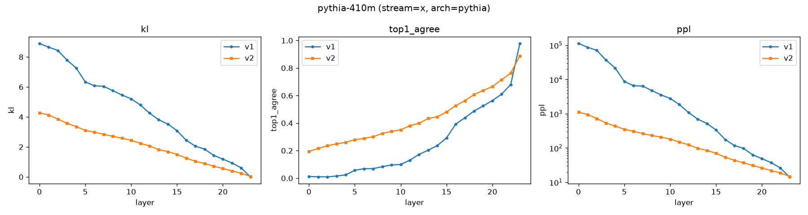

# Project Gamma — Phase 0

**Phase 0 reproduces on a 4GB laptop GPU.** Below: classic logit-lens
behavior recovered on Pythia-410M (KL-to-final and perplexity collapse
monotonically with depth, top-1 agreement with the model's own output
climbs to 0.98) — the sanity anchor for the whole instrumentation stack,
run on an RTX 3050. Full results: [`reports/phase0_validation_report.md`](reports/phase0_validation_report.md).



Instrumentation library + validation report for the Phase 0 deliverable of
[`protocol/gamma_protocol.md`](protocol/gamma_protocol.md) ("Infrastructure and Probe Harness").

**Pre-registration:** the frozen protocol is hashed and tagged —
see [`protocol/PREREGISTRATION.md`](protocol/PREREGISTRATION.md)
(`sha256: 90c547a5fcd6...`, git tag `pre-registration-v1`). Deviations
from the frozen document are logged, dated, as amendments rather than
silent edits: [`protocol/AMENDMENTS.md`](protocol/AMENDMENTS.md).

**Addendum:** a review caught a real methodological error (Phase 0's
`h_t^(l)` was actually the mixer's per-token output, not the persistent
recurrent state) and asked for a calibration floor before trusting any
decodability claim. Both are addressed in
[`reports/phase0_addendum_report.md`](reports/phase0_addendum_report.md):
the stream-path finding survives the floor by 1-4 orders of magnitude;
the genuine recurrent state shows **no signal above the floor at pilot
scale** — an open, unresolved question for Phase 1, not a quiet win.

**Phase 1 kickoff:** [`reports/phase1_kickoff_report.md`](reports/phase1_kickoff_report.md)
resolves the pilot's budget confound (matched-budget sweep: state stays
flat near the floor across a 16x budget range while stream stays
strong even at the smallest budget — real evidence, not just an
underpowered null) and runs the pre-registered causal dissociation
(state transplant vs. matched-magnitude noise) — which landed on
neither pre-registered outcome: transplant is consistently *less*
disruptive than noise, suggesting the state is structured and causally
loaded but not vocabulary-shaped. See Amendment 3.

**Scope note:** this build targets the 130M-370M tier of the protocol's
checkpoint matrix (Mamba-130M/370M vs. Pythia-160M/410M) rather than the
full ladder up to 7B — see Amendment 1. The dev machine has an RTX 3050
with 4GB VRAM, against the protocol's stated 12GB baseline; the 2.7B+
tiers don't fit. Extending `gamma/models.py`'s `REGISTRY` is the way to
add tiers later on better hardware.

## Layout

- `gamma/models.py` — checkpoint registry, model loading
- `gamma/hooks.py` — state extraction, section 3.1. Two distinct capture
  targets — see "Stream vs. state" below.
- `gamma/lens.py` — Gamma-lens V1 (zero-shot), V2 (tuned lens, stream
  path), V2State (tuned lens, genuine recurrent-state path), section 3.2
- `gamma/controls.py` — calibration-floor controls (shuffled-target,
  Gaussian-matched) for any V2 result, before it's trusted as evidence
- `gamma/patching.py` — activation-patching harness (causal validation),
  scaffolded, not yet run as an experiment
- `gamma/judge.py` — OpenRouter judging pipeline + rubric, section 3.3
- `gamma/data.py` — held-out text corpus (Pile sample) for lens training/eval
- `gamma/validate.py` — state collection + metrics for the validation gate
- `scripts/run_phase0_model.py` — run the stream-path pipeline on one checkpoint
- `scripts/stream_calibration_floor.py` — calibration floor for the stream path
- `scripts/state_pilot.py` — genuine recurrent-state pilot + calibration floor
- `scripts/plot_phase0.py` / `scripts/plot_state_pilot.py` — depth-axis plots from saved metrics
- `reports/phase0/<model>/` — metrics, lens weights, plots per checkpoint
- `reports/phase0_validation_report.md` — the section 3.4 gate report (original)
- `reports/phase0_addendum_report.md` — response to review: pre-registration,
  the h_t^(l) correction, calibration-floor results

## Design decisions worth knowing about

**Stream vs. state — read this before trusting any Mamba result.**
Phase 0 originally hooked the Mamba mixer's per-token *output* (post-scan,
post-gate, post-`out_proj`, pre-residual-add) and called it `h_t^(l)`.
That was wrong: that quantity doesn't persist across token positions,
and the protocol's `h_t^(l)` means the object that does — the genuine
`(d_inner, d_state)` recurrent state, which HF's Mamba only exposes
through its decoding cache, not a single batched forward pass. This is
documented as a correction, not silently fixed — see
[Amendment 2](protocol/AMENDMENTS.md). Two capture paths now exist:

- `StreamExtractor` (batched forward, one call): residual `x_t^(l)`
  (both architectures) and mixer `mixer_output_t^(l)` (Mamba). Correct
  and sufficient for depth-axis mapping and the transformer comparison —
  this is what Phase 0's validation gate actually tested.
- `RecurrentStateExtractor` (step-by-step cached decoding, one call per
  token): the genuine persistent state. Required for anything that's a
  claim about persistence — trajectories, anticipation, transplant, the
  interoceptive loop. Slower by construction; see `gamma/hooks.py` docstring.

Whether the *stream* is vocab-anchored and whether the *true state* is
vocab-anchored are separate, separately-measured questions, checked
against `gamma/controls.py`'s calibration floor rather than taken at
face value (a trained affine translator can manufacture apparent
decodability; the tuned-lens literature knows this failure mode). First
read (`reports/phase0/mamba-130m_state_pilot/`, full discussion in
`reports/phase0_addendum_report.md` section 3): the stream clears the
floor by 1-4 orders of magnitude; the genuine state shows no signal
above the floor at pilot scale. That's underpowered evidence, not a
resolved answer — Phase 1 needs a properly-scaled run before concluding
either way.

**Held-out corpus.** The protocol says "held-out Pile text"; the Pile's
original host is gone, so we use `NeelNanda/pile-10k`, the standard
community replacement sample, split into disjoint lens-train / gate-eval
halves.

**No custom CUDA kernels.** `mamba-ssm`/`causal-conv1d` aren't installed;
HF's Mamba falls back to its pure-PyTorch sequential scan. Slower, but
correct, and avoids a fragile build against this environment's CUDA
toolkit. Worth revisiting if Phase 1's larger corpora make this a
bottleneck — the recurrent-state path in particular is O(seq_len)
forward calls per batch, not one.

**Trained-lens weights aren't in git history.** `reports/phase0/*/lens_v2.pt`
files (28-200MB each) are gitignored, not committed — they're
regenerable via `scripts/run_phase0_model.py` and one of them already
exceeds GitHub's 100MB hard limit. If reuse-without-retraining across
machines becomes worth the ceremony, these belong in a GitHub Release
artifact, not raw git blobs (repo history is forever; releases aren't).

**Result files get unique names.** `gamma/paths.py::unique_path` appends
a UTC timestamp to every result-writing script's output (`metrics__<ts>.json`,
`sweep_results__<ts>.json`, etc.) so a rerun never silently overwrites a
previous run's numbers — important once Amendment 4's multi-condition
sweeps start producing many runs. The original Phase 0/Phase 1 result
files (no timestamp suffix) are the specific runs already committed and
referenced by path in the reports below; they're left alone rather than
renamed retroactively, and the scripts that produced them no longer
write to those exact paths. The plot scripts (`plot_state_pilot.py`,
`plot_sweep.py`, `plot_transplant.py`) default to those original files
(reproducing the exact committed figures) and take `--input` to point at
a later, uniquely-named run instead.

## Running it

```
source .venv/bin/activate
python scripts/run_phase0_model.py <mamba-130m|pythia-160m|mamba-370m|pythia-410m>
python scripts/stream_calibration_floor.py <mamba-130m|mamba-370m>
python scripts/state_pilot.py --model mamba-130m
python scripts/plot_phase0.py
python scripts/plot_state_pilot.py
```
