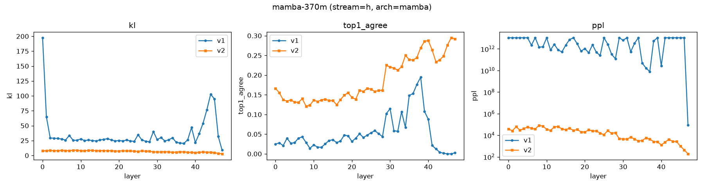

# Project Gamma — Phase 0 Validation Report

**Scope:** protocol/gamma_protocol.md §3 (Infrastructure and Probe Harness), restricted to the 130M–370M tier of the checkpoint matrix (§2) — see "Scope deviation" below.
**Models:** Mamba-130M, Pythia-160M, Mamba-370M, Pythia-410M
**Status: Phase 0 gate (§3.4) — PASS**

---

## 1. What was built

| Deliverable (§3) | File | Status |
|---|---|---|
| 3.1 State extraction hooks | `gamma/hooks.py` | Done — `x_t^(l)` (residual stream, both archs) and `h_t^(l)` (SSM mixer output, Mamba only) |
| 3.2 Gamma-lens V1 (zero-shot) | `gamma/lens.py::GammaLensV1` | Done |
| 3.2 Gamma-lens V2 (tuned lens) | `gamma/lens.py::GammaLensV2`, `train_tuned_lens` | Done — per-layer affine translator, trained on held-out text to minimize KL to final-layer logits |
| 3.3 Judging pipeline | `gamma/judge.py` | Built (OpenRouter client + §6.3 rubric + Cohen's κ). **κ-validation against 100 human-labeled transcripts is deferred** — no transcripts exist yet (that's a Phase 2 battery output) and no `OPENROUTER_API_KEY` is configured in this environment. Do not trust it for real scoring until that gate is separately run. |
| 3.4 Validation gate | `scripts/run_phase0_model.py`, `scripts/gate_check.py`, `scripts/plot_phase0.py` | Done — this report |

## 2. Scope deviations from the protocol (and why)

- **Checkpoint tier:** built and validated only the 130M/370M tier (Mamba-130M/370M vs. Pythia-160M/410M). The dev machine has an RTX 3050 with **4GB VRAM**, against the protocol's stated 12GB (RTX 3060) baseline — the 2.7B+ tiers don't fit as designed. `gamma/models.py::REGISTRY` is structured to extend to the rest of the ladder on suitable hardware without other code changes.
- **`h_t^(l)` operationalization:** the protocol calls it "SSM hidden state (post-selective-scan)". HF's Mamba implementation never materializes the literal internal scan-state matrix in full (it's consumed inline in the scan). We hook the mixer's *output* — post-scan, post-gate, post-`out_proj`, pre-residual-add — which is post-selective-scan, lives in `hidden_size` space (so V1 needs no dimensionality-reducing readout), and is a per-layer quantity distinct from the residual stream, matching the protocol's intent that `h` and `x` be separately captured.
- **Held-out corpus:** the original Pile host is down; used `NeelNanda/pile-10k`, the standard community replacement, split into disjoint lens-train/gate-eval halves (200 docs → 6111 train tokens / 6048 eval tokens after fixed-length chunking at 64 tokens/sequence).
- **No custom CUDA kernels:** `mamba-ssm`/`causal-conv1d` are not installed; HF's Mamba falls back to its pure-PyTorch sequential scan (confirmed correct — see §3 below — just slower). Worth revisiting if Phase 1's larger corpora make this a bottleneck.
- **Mamba1, not Mamba2:** used the first-party `state-spaces/mamba-{130m,370m}-hf` checkpoints. §2's note to "prefer Mamba2 for cleaner state semantics" applies at the 2.7B tier where both exist; at 130M/370M the standard checkpoints are Mamba1.

## 3. Validation gate results (§3.4)

### Gate condition (a): hooks reproduce published logit-lens behavior on Pythia

Classic logit lens (residual stream `x_t^(l)` → model's own final norm + unembedding). Both V1 (zero-shot) and V2 (tuned) show the textbook pattern: KL-to-final and perplexity fall monotonically with depth, top-1 agreement with the final prediction rises monotonically, and V2 tightens all three at every layer relative to V1 (tuned lens outperforming plain logit lens, per Belrose et al.) — exactly the literature's shape.

| Model | Variant | Spearman(depth, KL) | Spearman(depth, ppl) | Spearman(depth, top1) | KL: L0→Lfinal | ppl: L0→Lfinal | top1: L0→Lfinal |
|---|---|---|---|---|---|---|---|
| Pythia-160M | V1 | −1.00 | −1.00 | 0.99 | 17.6 → 0.37 | 9.5e8 → 22.5 | 0.007 → 0.55 |
| Pythia-160M | V2 | −0.99 | −0.99 | 0.99 | 5.2 → 1.23 | 3227 → 61.6 | 0.18 → 0.40 |
| Pythia-410M | V1 | −1.00 | −1.00 | 1.00 | 8.9 → 0.0002 | 1.1e5 → 14.4 | 0.012 → 0.98 |
| Pythia-410M | V2 | −1.00 | −1.00 | 1.00 | 4.3 → 0.035 | 1114 → 15.0 | 0.19 → 0.89 |

Pythia-410M's V1 top-1 agreement reaching 0.98 at the final layer, with near-zero KL, is the expected sanity anchor (final-layer logit lens ≈ the model's actual output by construction). **Gate condition (a): PASS.**

### Gate condition (b): Gamma-lens on Mamba produces non-degenerate distributions

Gamma-lens on `h_t^(l)` (mixer output). Result is a genuine, reportable dissociation:

| Model | Variant | Spearman(depth, KL) | Spearman(depth, ppl) | ppl: L0→Lfinal |
|---|---|---|---|---|
| Mamba-130M | V1 (zero-shot) | −0.20 | −0.35 | 1.1e13 → 4108 |
| Mamba-130M | V2 (tuned) | **−0.88** | **−0.88** | 21937 → 174 |
| Mamba-370M | V1 (zero-shot) | −0.02 | −0.12 | 1.1e13 → 91147 |
| Mamba-370M | V2 (tuned) | **−0.92** | **−0.92** | 38840 → 190 |

V1 (no learned components) is noisy and only weakly monotonic — unsurprising, since each layer's raw mixer output is a fresh contribution to the residual, not (like a transformer's residual stream) a running sum in a basis the final norm+unembed were fit to expect at every depth. V2's per-layer affine translator compensates for this basis drift and produces a clean, strongly monotonic signal at both 130M and 370M (perplexity drops ~2–3 orders of magnitude from first to last layer, non-degenerate at every layer, no NaNs/collapse). This is exactly the V1-purist-check vs. V2-workhorse split the protocol anticipates in §3.2. **Gate condition (b): PASS (via V2; V1 alone would not clear a strict monotonicity bar and should not be relied on solo for Phase 1).**

## 4. Artifacts

- Per-model metrics, tuned-lens weights, loss curves, plots: `reports/phase0/<model>/`
- Trained V2 lenses (`lens_v2.pt`) are reusable inputs to Phase 1 depth-axis mapping (§4.1) without retraining.

## 5. Recommendation for Phase 1

1. Proceed to §4.1 depth-axis mapping using **V2 as the primary lens**, V1 reported alongside per §3.2's convention.
2. The V1-noisy / V2-clean dissociation on Mamba's `h` stream is itself worth carrying forward as a footnote in the Phase 1 write-up — it's a concrete, quantified instance of "the SSM's per-layer output isn't naturally in the vocabulary basis the way a transformer's residual stream is," which bears on how the workspace-band search (§4.1.2) should be scoped for `h` vs. `x`.
3. Before scaling corpus size for Phase 1, budget for the sequential-scan slowdown (no CUDA kernels): Mamba-370M's V2 training took ~14 min on 6111 held-out tokens on this GPU vs. ~3 min for Pythia-410M's classic logit lens on the same token count.
4. κ-validation of the judge (§3.3) is a hard prerequisite before Phase 2 begins — needs both an `OPENROUTER_API_KEY` and ~100 human-labeled transcripts, neither of which exist yet.
