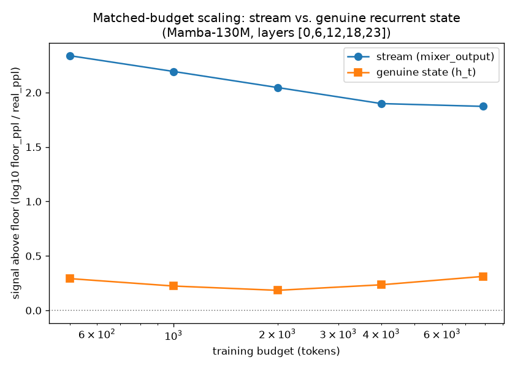
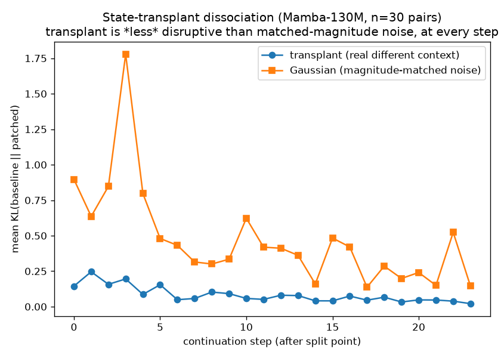

# Phase 1 Kickoff — Matched-Budget Sweep and State-Transplant Dissociation

Reports the two experiments pre-registered in `protocol/AMENDMENTS.md`,
Amendment 3, run on Mamba-130M (small tier, RTX 3050). Both were written
up *before* running, per that amendment — this section reports what
actually happened against those stated predictions, including where the
result didn't match either predicted pattern.

## 1. Matched-budget scaling sweep

**Correction, same day:** the "signal-above-floor" number below is a
perplexity-only aggregate. A metric-separated re-analysis
(`reports/phase1_sweep_metric_reanalysis.md`) found perplexity was
masking a real, statistically robust top1_agree/KL signal in the state
path (small — ~3-7x weaker than stream's — and still flat with budget,
but not "near zero" as characterized below). Read that report alongside
this section before treating "state shows no signal" as settled; the
comparative ordering and flat shape both hold, the "no signal"
characterization specifically doesn't.

Fixes the Phase 0 pilot's invalid comparison (state lens trained on
~465 tokens vs. stream lens on ~6111 — different budgets). Both lenses
now trained at *identical* budgets: 500, 1000, 2000, 4000, 7900 tokens,
5 representative layers (0, 6, 12, 18, 23), Mamba-130M.

| Budget | Stream signal-above-floor | State signal-above-floor |
|---|---|---|
| 500 | 2.34 | 0.29 |
| 1000 | 2.19 | 0.22 |
| 2000 | 2.05 | 0.18 |
| 4000 | 1.90 | 0.24 |
| 7900 | 1.87 | 0.31 |

(signal-above-floor = mean per-layer log10(shuffled-floor perplexity /
real perplexity); 0 = indistinguishable from floor, higher = more real
decodability.)

**Result: matches the Reading-B prediction, not Reading A.** Stream
decodability is strong even at the *smallest* budget tested (500 tokens)
and stays strong throughout — it doesn't need much data to find. State
signal stays flat at ~0.2-0.3 across the entire 16x budget range, with
no rising trend. Amendment 3's Reading A prediction ("state curve rises
with budget, gap narrows") did not occur; Amendment 3's Reading B
prediction ("state curve stays flat near zero while stream stays
elevated") did.

**Scope of what this rules out and doesn't:** this sweeps to ~7900
tokens, not the "500 to 500k" originally proposed — the state path's
sequential-decoding collection cost sets a lower ceiling on this
hardware (see Amendment 3). A flat curve over a 16x range is real
evidence against "the state is vocab-anchored but needs more data,"
within that range. It does not rule out decodability emerging at a
scale two more orders of magnitude out. That extension is a 3060-tier
task, not a claim this run can make.

## 2. State-transplant causal dissociation

Amendment 3 pre-registered two possible outcomes for this test, both
against the same baseline: mid-sequence, transplant the full recurrent
state from a different, unrelated context, and compare against a
magnitude-matched Gaussian-noise perturbation. Mamba-130M, 30 document
pairs, 40-token sequences, split at token 16 (24 continuation tokens),
layers [0, 6, 12, 18, 23].

| | mean KL(baseline, patched) | mean top-1 changed |
|---|---|---|
| Transplant (real different context) | **0.084** | 12.6% |
| Gaussian (magnitude-matched noise) | **0.474** | 23.6% |

Transplant KL was lower than Gaussian KL in **30/30 pairs** (0% where
transplant exceeded Gaussian), consistently at every one of the 24
continuation steps.

**This is neither pre-registered outcome.** Amendment 3 named two
possibilities: (a) the strong result — transplant diverges *more* than
noise, showing context-specific causal content in a non-vocabulary code;
or (b) transplant and noise diverge similarly, showing generic
perturbation-sensitivity rather than content. What happened instead:
**transplant is consistently and substantially *less* disruptive than
matched-magnitude noise.** Neither prediction anticipated this
direction, and it is reported as what it is, not fitted to either
forecast after the fact.

**What this does establish, without overclaiming further:**
- The state is confirmed causally loaded, as architecturally guaranteed
  — transplant is not a no-op (nonzero KL, 12.6% top-1 changes).
- Real recurrent states — from *any* natural context, not just the
  original one — sit on some structured manifold the model handles
  coherently; magnitude-matched noise does not share that structure and
  is more damaging to continue from. That's a fact about the state's
  geometry (it has learned, non-arbitrary structure distinguishable from
  noise of the same scale) independent of whether that structure is
  vocabulary-shaped — and section 1's sweep says it probably isn't.
- Put together with section 1: the state looks like a real, structured,
  causally load-bearing representation that is *not* legible through a
  vocabulary-trained lens at matched budget. "Structured but not
  vocabulary-shaped" is a more specific and more interesting claim than
  either pre-registered outcome alone, and it's the one both experiments
  actually point at together.

**What would sharpen this further, next:** whether transplant divergence
correlates with source/target *semantic* similarity (transplants from
more-related contexts should be gentler than from less-related ones, if
the structure carries content rather than being purely generic-manifold
membership) — this run didn't control for pair relatedness and can't
distinguish "structured because it's valid-state-manifold" from
"structured and specifically informative." That's the natural follow-up
before leaning further on this result.

## 3. Consequence for G1a/G1b (Amendment 3)

- **G1a (stream vocab-anchoring): PASS**, now on stronger footing —
  strong signal at even the smallest matched budget.
- **G1b (state vocab-anchoring): fails to clear the floor** across the
  tested budget range, while the state is independently confirmed
  causally structured and load-bearing. Read together, section 4.1
  (depth-axis mapping) should proceed on the stream as designed; section
  4.2 (time-axis: trajectories, anticipation) and the interoceptive loop
  should not assume the state's native tongue is tokens — per Amendment
  3's consequence note, that design choice now needs to be made
  deliberately in Phase 3, not inherited.
