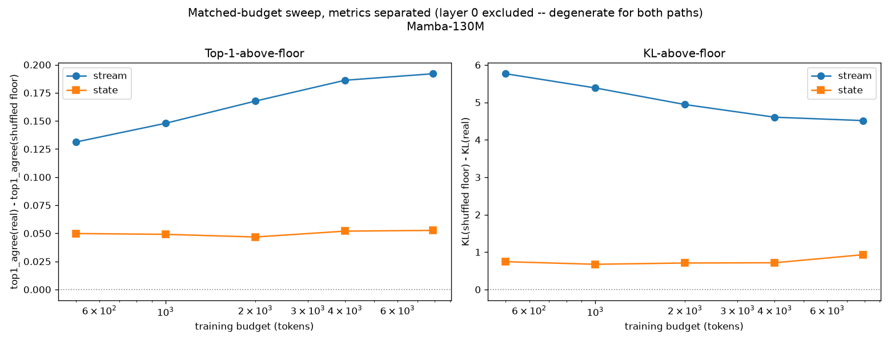

# Matched-Budget Sweep — Metric-Separated Re-analysis

Re-analyzes the existing matched-budget sweep (`reports/phase1_kickoff_report.md`,
section 1; raw data `reports/phase1/matched_budget_sweep/sweep_results.json`)
with per-metric breakdowns rather than the single perplexity-derived
"signal above floor" number. No new experiment was run — this is
re-analysis of already-collected data, prompted by a request to check
top-1-above-floor as its own test before treating the earlier
vocab-illegibility framing as settled.

Reproduce: `python scripts/reanalyze_sweep_by_metric.py` then
`python scripts/plot_metric_reanalysis.py`.

## Why perplexity alone was the wrong single number to lead with

Perplexity (`exp(mean NLL)`) is dominated by the probability mass a lens
assigns on the cases it gets badly wrong — it's a calibration-sensitive
metric, not a rank-accuracy metric. `GammaLensV2State`'s readout is a
freshly-initialized rank-128 bottleneck, trained on a small budget,
mapping a much harder 24,576-dimensional input (`d_inner x d_state`)
than the stream lens's 768-dimensional one. A lens can have real,
consistent top-1 ranking signal above a shuffled floor while still
looking flat on perplexity, if its confidence calibration on the cases
it gets *right* isn't yet well-formed. That's close to what happened
here.

## What the separated metrics show

Bootstrap 95% CIs (n = layers x budgets, layers = `[0, 6, 12, 18, 23]`,
budgets = `[500, 1000, 2000, 4000, 7900]`), `top1_diff` = real top-1
agreement minus shuffled-floor top-1 agreement (positive = real beats
floor), `kl_diff` = shuffled-floor KL minus real KL (positive = real
beats floor):

| Path | Layer scope | n | top1_diff | KL_diff |
|---|---|---|---|---|
| stream | excl. layer 0 | 20 | **+0.165** [+0.139, +0.192] | **+5.04** [+4.62, +5.54] |
| stream | layer 0 only | 5 | +0.133 [+0.115, +0.147] | +3.53 [+3.39, +3.70] |
| state | excl. layer 0 | 20 | **+0.050** [+0.046, +0.055] | **+0.75** [+0.56, +0.97] |
| state | layer 0 only | 5 | +0.0004 [+0.0000, +0.0011] | −0.098 [−0.42, +0.21] |

**Layer 0 is degenerate for both paths at this metric** (top1_diff CI for
state at layer 0 is `[0.0000, 0.0011]` — indistinguishable from zero;
real and shuffled top1_agree are numerically near-identical in the raw
per-layer table, both evidently dominated by a most-frequent-token
default this early in the state's accumulation). Layer 0 was included
undifferentiated in the original perplexity aggregate; separating it out
here is itself informative, not just a filtering convenience.

**Excluding layer 0, the state path has a real, tight-CI signal above
floor in both top1_agree and KL — the CI clears zero comfortably at
every budget.** This contradicts the earlier framing ("no signal above
floor... state stays flat near zero"), which was accurate for the
perplexity aggregate specifically but got generalized further than the
data supported. The corrected picture: **the state's vocab-relevant
signal is real, not absent — it is roughly 3x smaller than the stream's
in top1 terms (0.050 vs 0.165) and roughly 5-7x smaller in KL terms
(0.75 vs 3.5-5.0), and — like the original perplexity-based result — it
stays flat rather than rising across the 500-7900 token budget range.**

## What this does and doesn't change

- **Does not overturn** the core comparative finding: stream shows
  substantially stronger vocab-anchoring than state by every metric
  checked, at every budget. That ordering is unchanged and, if anything,
  now confirmed across three independent metrics (ppl, KL, top1) instead
  of one.
- **Does change** the characterization of the state result from "no
  signal above floor" to "a real but small signal above floor that
  doesn't grow with budget in the range tested." Those are different
  claims — the first says the state carries nothing a vocabulary lens
  can find; the second says it carries something, modestly, and
  perplexity's calibration-sensitivity hid it.
- **Still doesn't resolve G1b.** A small-but-real, budget-flat top1/KL
  signal is consistent with several readings that this data alone can't
  separate: (a) a genuine but weak vocabulary-adjacent component of the
  state, (b) an artifact of the rank-128 readout's limited capacity
  specifically for rank accuracy vs. calibration, or (c) something the
  Amendment 4 manifold analysis (participation ratio, on-manifold noise
  condition) may speak to once run. Reported as numbers; adjudication
  is reserved, per standing project norm.

## Recommendation carried into Amendment 4

Task 1's metrics section already specifies KL and NLL per step, not a
collapsed aggregate — consistent with this finding, not requiring a
change. Worth adding explicitly: report top1-equivalent (top-1 changed
under transplant, already in the state-transplant harness) and KL
separately in the Amendment 4 report too, rather than an AUC-only
summary, so this same masking can't recur there.
