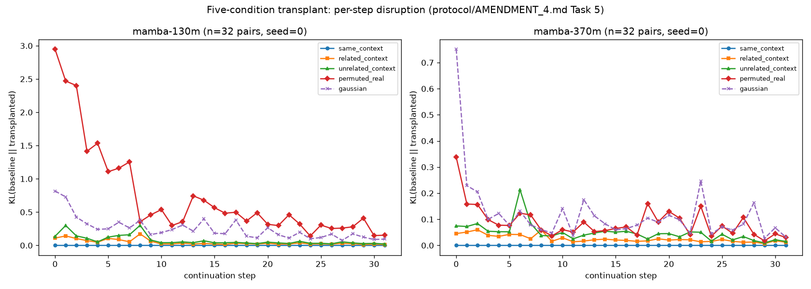

# Task 5 — Five-Condition Transplant Experiment

Results for protocol/AMENDMENT_4.md (revision 1) Task 5. Predictions
P-A4-1 through P-A4-3 were pre-registered at tag `pre-registration-v4-r2`
before any of this ran. This report scores P-A4-1 (the only prediction
Task 5 alone can test — P-A4-2/3/4 need Tasks 6-7's corpus and PCA
basis, and land in Task 8's report).

Reproduce: `python scripts/transplant_five_condition.py --model
<mamba-130m|mamba-370m> --n-pairs 32 --seeds 0 1 2 [--include-conv]`,
then `python scripts/plot_transplant_five_condition.py`.

## Deviation from the frozen mechanics, documented per standing rule

The frozen mechanics specified "48 tokens, split 16" donor spans, a
convention inherited from Phase 1's design (teacher-forced continuation
on the *host document's own real text*). Task 5's metric spec calls for
something different — "NLL of the baseline's own **greedy**
continuation, evaluated under the transplanted model" — which needs no
real continuation text at all: baseline generates its own 32-token
continuation autoregressively from a 16-token prefix, and every
condition is then teacher-forced against *that* shared trajectory, not
the host document's actual text. Donor states (related, unrelated) only
need their own 16-token prefix, not a full 48-token span. Prefix length
(16) and continuation length (32) match the frozen spec exactly; only
the now-unnecessary donor "continuation" portion of the 48-token span is
dropped. Implemented in `gamma/patching.py::greedy_continue` /
`teacher_force_continue`; full reasoning also in that module's docstring
and `scripts/transplant_five_condition.py`'s header.

## Same-context integrity check

**Passed exactly**, both models, both sweeps: `same_context` AUC-KL =
0.000 (CI [0.000, 0.000]) in every run. Teacher-forcing a model on its
own greedily-generated continuation, with its own recomputed state
transplanted back in, reproduces the unpatched baseline bit-for-bit.
Smoke-tested independently beforehand (`gamma/patching.py` primitives,
CPU, max abs logit diff = 0.0) before any of the N=32 runs. The harness
mechanism is verified correct.

## Primary results (recurrent_states only, both models, N=32 pairs)

| Condition | Mamba-130M AUC-KL | Mamba-370M AUC-KL |
|---|---|---|
| same_context | 0.000 | 0.000 |
| related_context | 1.472 [1.06,1.96] | 0.808 [0.64,0.99] |
| unrelated_context | 2.417 [1.73,3.35] | 1.552 [1.21,1.98] |
| permuted_real | 23.466 [13.66,35.75] (seed 0) | 2.797 [2.01,3.93] (seed 0) |
| gaussian | 7.946 [5.59,10.86] | 3.799 [2.85,4.90] |

## P-A4-1, part 1: monotonic ordering (same < related < unrelated < permuted)

**PASS, both models, both sweeps.** Holm-Bonferroni-corrected paired
bootstrap on all three adjacent links in the chain:

| Comparison | Mamba-130M | Mamba-370M |
|---|---|---|
| same < related | p<0.0001, reject H0 | p<0.0001, reject H0 |
| related < unrelated | p<0.0001, reject H0 | p<0.0001, reject H0 |
| unrelated < permuted | p<0.0001, reject H0 | p=0.0004, reject H0 |

All six tests (3 links x 2 models) reject the null in the predicted
direction. This is the strongest, cleanest result in the experiment:
disruption really does order monotonically with how far the donor state
is from "the state that would actually have been there," across two
model sizes, robust to the ssm+conv secondary sweep (same ordering,
130M — see below).

## P-A4-1, part 2: permuted-real ≈ Gaussian — model-size-dependent, and seed-sensitive at 130M

**Not a clean PASS or FAIL — reported as found, per standing rule.**

First pass (seed 0 only, matching how the ordering chain above is
scored): 130M shows permuted_real *far* exceeding gaussian
(diff = -15.52, CI [-27.98, -5.22], clearly excluding zero); 370M shows
them statistically indistinguishable (diff = +1.00, CI [-0.05, 2.11],
touching zero).

**That 130M number does not hold up under the seed check the protocol
requires.** `permuted_real`'s per-seed AUC-KL mean: seed 0 = 23.47,
seed 1 = 8.03, seed 2 = 7.23 — a >3x spread, while `gaussian`'s spread
across the same seeds is 0.81 (essentially stable). Pooling all three
seeds' (seed, pair) trials (96 paired observations) rather than reading
seed 0 alone:

| | Mamba-130M pooled | Mamba-370M pooled |
|---|---|---|
| gaussian − permuted (AUC-KL) | -4.69, CI [-9.29, -0.93] | +0.28, CI [-0.18, 0.77] |
| Zero excluded? | Yes (permuted > gaussian) | No (≈ holds) |

**Verdict: at 370M, "permuted ≈ Gaussian" holds, both by seed-0 and
pooled analysis — consistent with P-A4-1. At 130M, permuted-real is
robustly *more* disruptive than Gaussian even pooled across seeds, just
by a much smaller margin (4.7, not 15.5) than the single-seed number
suggested.** P-A4-1's second clause is a partial FAIL at 130M, a PASS at
370M. Score as **SURPRISE** overall for this clause: neither "holds at
both sizes" nor "fails at both sizes" was predicted, and the specific
finding — permutation's damage is far more seed-variable than Gaussian's
at the smaller model, converging toward Gaussian-like behavior at the
larger one — wasn't anticipated by the prediction as written. Worth
flagging for Task 6/7's manifold analysis: high seed-to-seed variance in
how disruptive a *fixed* permutation is suggests the (d_inner, d_state)
space isn't uniformly structured — some permutations land in
much-more-damaging regions of the space than others, more so at 130M
than 370M.

## Secondary sweep: recurrent_states + conv_states, Mamba-130M only

| Condition | ssm-only AUC-KL | ssm+conv AUC-KL | delta |
|---|---|---|---|
| same_context | 0.000 | 0.000 | 0.000 |
| related_context | 1.472 | 1.997 | +0.525 |
| unrelated_context | 2.417 | 3.274 | +0.857 |
| permuted_real | 23.466 | 23.711 | +0.246 |
| gaussian | 7.946 | 7.946 | 0.000 |

`same_context` and `gaussian` show exactly zero delta by construction
(gaussian's conv channel is carried through unmodified from the host's
own snapshot — see `gamma/patching.py::gaussian_snapshot_like` — so
patching it back in is a no-op; same-context is identity regardless).
`related`/`unrelated` get modestly *more* disruptive with conv also
patched (donor's conv genuinely differs from host's); `permuted_real`'s
delta is small relative to its already-large magnitude, since the
recurrent-state permutation dominates and its conv channel is likewise
just carried through from the unrelated donor unchanged. The ordering
chain (P-A4-1 part 1) holds identically under the secondary sweep.
Ordering-test numbers: same<related p<0.0001, related<unrelated
p<0.0001, unrelated<permuted p<0.0001 — unchanged conclusion from the
primary (ssm-only) sweep.

## What this doesn't do

Per the adjudication boundary in `protocol/AMENDMENT_4.md`: this reports
numbers and PASS/FAIL/SURPRISE scoring against pre-registered
predictions, not a G1a/G1b verdict. P-A4-2, P-A4-3, and P-A4-4 are not
addressed here — they require Task 6's state corpus and PCA basis
(P-A4-3), and Task 7's on-manifold-noise condition built on top of it
(P-A4-2), plus the larger multi-model corpus for P-A4-4. All land in
Task 8's consolidated report.
