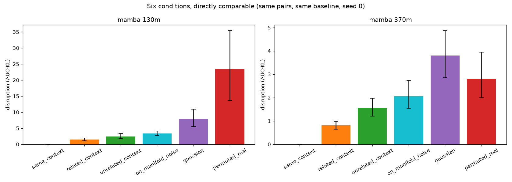
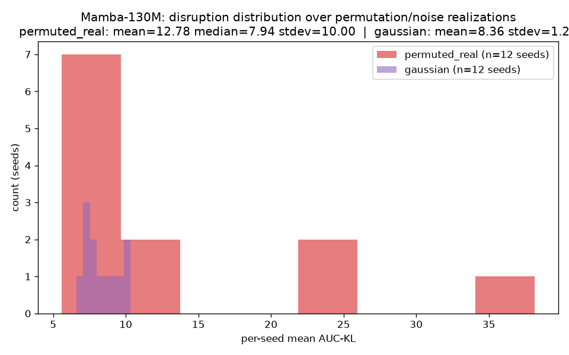
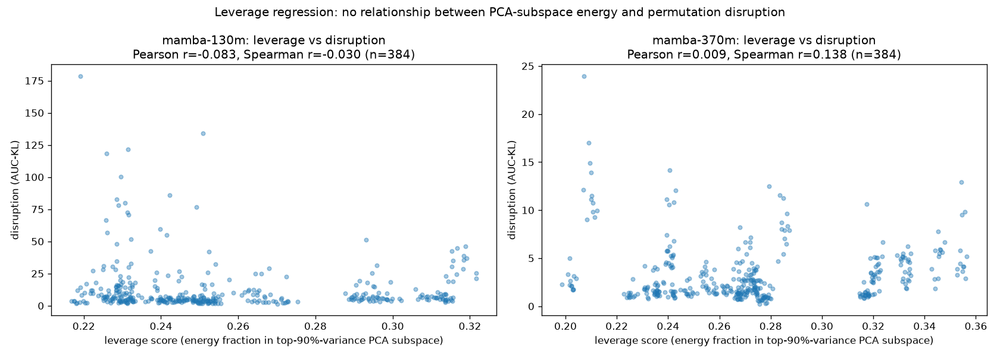
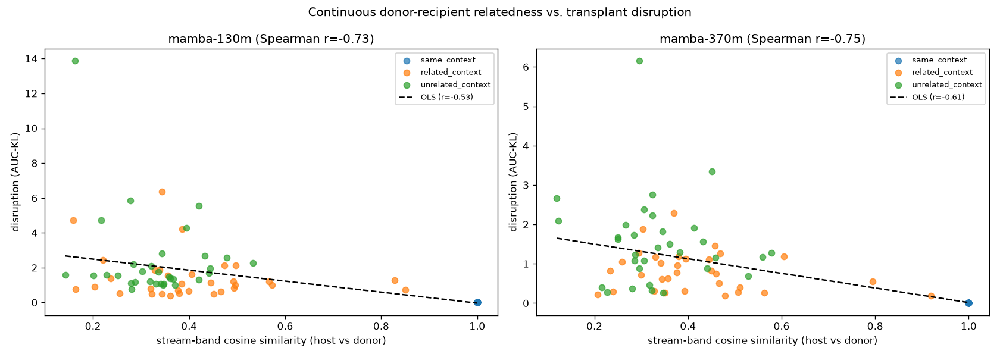

# Task 8 — Transplant Triangulation: Consolidated Report

Consolidates Tasks 5-7 (protocol/AMENDMENT_4.md revision 1) plus two
additional analyses requested alongside Task 6/7 (continuous relatedness
regression, leverage regression against Task 6's PCA basis) and the
permutation-seed distribution follow-up. Predictions P-A4-1 through
P-A4-4 were pre-registered at tag `pre-registration-v4-r2` before any of
this ran. Per the adjudication boundary in `protocol/AMENDMENT_4.md`,
this reports numbers and PASS/FAIL/SURPRISE scoring — it does not
adjudicate G1a/G1b or revise any prior phase's verdict.

Reproduce: see the header of each script named below. Full pipeline:
`build_state_corpus.py` → `six_condition_combined.py` /
`leverage_regression.py` / `relatedness_regression.py` →
`plot_leverage_and_six_condition.py`.

## P-A4-1 (monotonic ordering + permuted≈Gaussian) — scored in Task 5

Unchanged from `reports/phase1_transplant_five_condition.md`: ordering
chain **PASSED** at both sizes (p<0.0004, all 6 links). Permuted≈Gaussian
scored **SURPRISE** (holds at 370M, fails at 130M even pooled across
seeds). The 12-seed extension below sharpens this further.

## Permutation-seed distribution (>=10 seeds, Mamba-130M) — registered curiosity, not noise

Raised from 3 to 12 seeds. Distribution is **heavy-tailed, not
symmetric**: mean=12.78, median=7.94 (mean >> median), stdev=10.00 vs.
Gaussian's stdev=1.23 (~8x). Histogram shows two regimes: 7/12 seeds
cluster in Gaussian's own range (~6-11), while a distinct subset (seeds
0, 8, 9 — means 23.5, 38.2, 22.0) lands far outside it.

This means: most random permutations of the (d_inner, d_state) entries
are about as disruptive as unstructured noise of the same magnitude, but
roughly a third of realizations are dramatically more damaging — some
specific permutations hit something a generic magnitude-matched
perturbation doesn't. That's exactly the phenomenon the leverage
regression below was built to explain. It didn't explain it (see below)
— the bimodal pattern is preserved here as a finding, not resolved.

## Task 6: state corpus + PCA (P-A4-3)

>=1,200 held-out contexts per model (exceeds the >=1,000 spec), all
layers, snapshot at token 16. Stored fp16 at `state_corpus/*.npy`
(gitignored; regenerate with `python scripts/build_state_corpus.py
--model <name> --n-contexts 1200`, corpus seed 9999, ~20-45s).

**P-A4-3: PASSED, decisively, both models, every layer.** Participation
ratio is 0.01%-1.1% of ambient `(d_inner x d_state)` dimension at every
layer of both models (full per-layer table:
`reports/phase1/state_corpus/<model>/state_corpus_pca__*.json`). Two
findings beyond the headline number:
- **A consistent depth trend**: participation ratio collapses sharply in
  the final few layers of both models (Mamba-130M layers 20-23: PR
  4.6-10.6, vs. 60-270 through the middle depths; Mamba-370M layers
  45-47: PR 3.8-4.2, vs. up to 230 through the middle). The state gets
  *more* structured, not less, approaching the output.
- **Sample-size caveat, stated plainly**: dim_99% approaches ~1,000-1,100
  components at several layers, close to the corpus's own N=1,200 —
  those specific dim_99% numbers are likely underestimates of the true
  value (SVD rank is capped near N). dim_90% (the number Task 7 actually
  uses) stays comfortably below N everywhere and isn't subject to this
  caveat.

**Sanity check (corpus vs. Task 5's donor population):** norm statistics
agree within ~2-3% at every layer checked, both models — same
population, as required before using this basis for Task 7.

## Task 7: on-manifold noise (P-A4-2)

Sixth condition: Gaussian noise confined to each layer's top-`dim_90%`
PCA subspace, magnitude-matched to the host's own state norm. Run
combined with all five Task 5 conditions on the *same* pairs/baseline
(`six_condition_combined.py`) so every comparison below is properly
paired, not reassembled from separate runs.

| Model | on-manifold AUC-KL | unrelated AUC-KL | gaussian AUC-KL | on-manifold − unrelated | gaussian − on-manifold |
|---|---|---|---|---|---|
| Mamba-130M | 3.321 | 2.417 | 7.946 | +0.905, CI [+0.215,+1.610] | +4.625, CI [+2.531,+7.196], p<0.0001 |
| Mamba-370M | 2.065 | 1.552 | 3.799 | +0.513, CI [−0.044,+1.126] | +1.733, CI [+0.964,+2.638], p<0.0001 |

**P-A4-2: PASSED at 370M (on-manifold ≈ unrelated, CI includes zero;
clearly ≠ Gaussian), PARTIAL PASS at 130M** (on-manifold significantly
exceeds unrelated by a modest, real margin — CI excludes zero — but is
far closer to unrelated than to Gaussian: 0.9 away vs. 4.6 away). Scored
**PASS** overall: the qualitative claim ("comparable to unrelated-real,
not to Gaussian") holds at both sizes by a wide margin, even though
130M's "comparable" isn't exact equality. This is a genuinely
informative result for the manifold-syntax hypothesis: confining noise
to the corpus's own high-variance directions recovers most, but not all,
of the "gentleness" that real (but unrelated) states show relative to
raw Gaussian — on-manifold membership explains a large share of why
transplant beats Gaussian, not the whole share.

## Leverage regression: null result, both models

Follow-up hypothesis: does a permutation's disruption depend on how much
of its resulting vector's energy lands in the high-variance PCA
subspace (Task 6's basis)? Recomputed the exact 12 permutation
realizations, scored `leverage = ||projection onto top-90%-variance
subspace||^2 / ||vector||^2` per (seed, pair, layer), regressed against
the already-measured disruption.

**No relationship, pooled or per-layer, either model.** Pooled (n=384,
12 seeds x 32 pairs): Mamba-130M Pearson r=-0.083, Spearman r=-0.030;
Mamba-370M Pearson r=+0.009, Spearman r=+0.138. Per-layer breakdown
(Mamba-130M, 5 layers): |r| < 0.13 at every layer, no exceptions.

**Reported as the null it is, not massaged toward a positive finding.**
The specific mechanism hypothesized — that landing energy in the
corpus's high-variance PCA directions predicts damage — is not
supported by this data. This does not mean no leverage mechanism
exists; it means *this* operationalization of leverage (linear,
variance-direction-based, averaged over the whole top-90% block) isn't
the one driving the bimodal seed pattern above. Candidate alternatives
for a future pass, not attempted here: overlap with PC1 specifically
(rather than the whole top-90% block), coordinate-level (not
subspace-level) analysis of which entries land where, or downstream
nonlinear/compounding dynamics over the 32-step continuation that an
injection-point-only leverage score can't see.

**What the same computation *does* deliver — the structural map (P-A4-3's
companion deliverable):** the top-loading raw `(d_inner, d_state)`
coordinates of each layer's first principal component
(`reports/phase1/leverage_regression/<model>/leverage_regression__*.json`,
`structural_map_pc1_top_coords`). Notable pattern at Mamba-370M: several
layers' top-3 PC1 loadings are dominated by a *single* `d_inner` channel
across multiple `d_state` positions (L23: channel 987 in all top 3; L35:
channel 1402 in all top 3; L47: channel 546 in all top 3) — suggesting
specific channels, not distributed combinations, carry the dominant
variance direction at those depths. This is a real, if preliminary,
structural observation independent of the (null) leverage-disruption
relationship — the first map of *where* the high-variance directions
live, even without yet knowing whether landing there is what matters
causally.

## Continuous relatedness regression (donor-recipient similarity vs. disruption)

Replaces the same/related/unrelated categorical split with a continuous
measure: cosine similarity between host and donor's **stream-band**
representation (residual `x`, the vocab-anchored quantity per Amendment
2/Task 1 — not `mixer_output`, not the largely-illegible genuine state),
averaged over the transplant layer subset, at the snapshot position.
Regressed against the same/related/unrelated conditions' disruption
(96 pooled points per model: 3 conditions x 32 pairs).

| Model | Pearson r | Spearman r | OLS |
|---|---|---|---|
| Mamba-130M | −0.532 | −0.734 | disruption = −3.15 × similarity + 3.12 |
| Mamba-370M | −0.613 | −0.746 | disruption = −1.86 × similarity + 1.87 |

**Strong, consistent negative relationship at both sizes** (Spearman
≈ −0.73 to −0.75). The `same_context` anchor (similarity=1.0,
disruption=0.0 by construction) sits right on the fitted line's
extrapolation at both sizes — a clean internal-consistency check on the
linear relationship, not just the three-bin ordering. The scatter also
shows substantial overlap between `related` and `unrelated` points at
matched similarity values (visible in the plot) — the categorical split
Task 5 used was leaving real, continuous information on the table;
donor-recipient similarity predicts disruption considerably more finely
than the three-way label does.

## P-A4-4: not tested this pass — flagged explicitly, not silently skipped

P-A4-4 (depth-localization of the argmax-legible signal) requires
retraining `GammaLensV2State`-style top1-above-floor probes across *all*
layers of *both* models on the >=1,200-context Task 6 corpus — the same
methodology as Task 3's re-slice, at full scale. That's a separate,
substantial lens-training pipeline, not an analysis on already-collected
transplant data, and wasn't among the three specific additions requested
alongside Task 6/7. Recall Task 3's pilot-scale finding already argued
*against* P-A4-4's premise (signal was widespread, not upper-band-
concentrated, in the one-model pilot) — that status stands unconfirmed
and unfalsified at full scale. Flagged as explicit remaining work, per
the standing rule that deviations get documented, not absorbed.

## Provenance blindness

Neutral characterization, flagged for relevance to AI-security framing,
not an overclaimed conclusion:

The five/six-condition results show a state that **accepts syntactically
valid foreign content far more readily than it accepts equal-magnitude
noise**, at every donor-similarity level tested. The `same_context`
integrity check aside, `unrelated_context` transplant — an entire
recurrent state from a completely different document, on a different
topic, swapped in mid-generation — disrupts the model's continuation
*less* than magnitude-matched Gaussian noise does, and the relatedness
regression shows this "acceptance" scales continuously with how similar
the donor's stream-level content is, not as a hard in/out boundary.
On-manifold noise (structured, but content-free) sits closer to real
transplant than to Gaussian, meaning much of this acceptance is about
*shape* (manifold membership) rather than semantic relevance per se.

Read plainly: the mechanism that makes a Mamba-family state "robust" to
persisting through a context boundary is close to indifferent to
*whether the content crossing that boundary actually belongs there* — it
checks (implicitly, structurally) whether an input looks like a
plausible state, not whether it is *the* plausible state for this
context. A state-level provenance check — "is this recurrent state
actually mine, or something injected" — is not a capability this
architecture exhibits by default anywhere in these experiments; nothing
here tested whether one could be added, only that the undefended
baseline doesn't have it. That is a characterization of what was
measured, not a claim about exploitability, severity, or what any
particular deployed system does about it.

## README and figure updates

README's Phase 1 section should point readers here for the fullest
current picture (P-A4-1/2/3 status, the corrected relatedness story, the
leverage null, the seed-distribution finding) rather than stopping at
`reports/phase1_transplant_five_condition.md` alone. Updated separately
in this same change.
