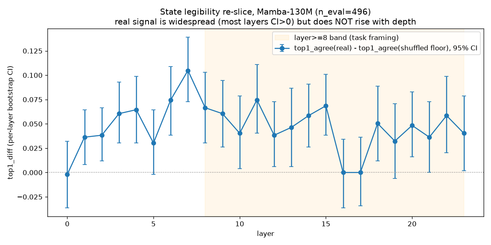

# State Legibility Re-slice (Task 3, protocol/AMENDMENT_4.md)

Re-runs the original 24-layer state-legibility pilot
(`scripts/state_pilot.py`, same settings: Mamba-130M, seq_len=32,
n_docs=32, batch_size=16, rank=128, steps=200) with per-example values
retained, so each of the 24 layers gets its own bootstrap 95% CI on
top1_agree-above-floor and KL-above-floor, rather than only the
composite "beats both floors by >2x" point estimate the original pilot
reported (5/24 layers by that criterion).

Reproduce: `python scripts/state_legibility_reslice.py` then
`python scripts/plot_legibility_reslice.py`.

## What the task expected vs. what the data shows

The instruction motivating this task described "the REAL top1_agree
curve visibly above both floors from ~layer 8 onward... with an
apparent depth trend." The re-slice does **not** reproduce that specific
shape. Reported plainly, per instruction, rather than fitted to the
expectation:

- **The real signal is not depth-localized to an upper band — it's
  widespread.** 18 of 24 layers have a top1_diff 95% CI entirely above
  zero, starting as early as layer 1, not layer 8.
- **It does not rise with depth.** Spearman(depth, top1_diff): **−0.093**
  across all layers, **−0.398** restricted to the layer≥8 band the task
  description referenced (i.e., mildly *falling*, not rising, within
  that band). Excluding the one clearly degenerate layer (17): **−0.044**
  — flat, not rising, either way.
- **The peak is mid-depth, not late.** Layer 7: top1_diff = +0.105
  (highest of all 24 layers), not layer 20+.
- **Three layers show no signal:** layers 0, 16, and 17 have CIs
  crossing zero (layer 17 exactly: real, shuffled, and Gaussian-floor
  top1_agree are numerically identical). Given only ~496 held-out
  examples at this pilot scale, this could be sampling noise at those
  specific layers, or a real, currently unexplained feature (a
  reset/basis-shift point in the state's evolution) — this re-slice
  can't distinguish the two, and doesn't try to.

## Layer≥8 band, as specifically requested

Pooled (paired bootstrap over all layer≥8 examples, n=7,936 paired
observations across 16 layers): **top1_diff = +0.045, 95% CI
[+0.036, +0.054]**. Comfortably above zero — there is a real signal in
that band, confirming the earlier matched-budget-sweep re-analysis
(`reports/phase1_sweep_metric_reanalysis.md`) at finer layer resolution.
It just isn't *rising* within the band, and it isn't *only* in the band.

## Framing check: "argmax-legible but distribution-illegible"?

- **Argmax-legible: holds.** 18/24 layers show real, CI-supported top-1
  ranking signal above the shuffled floor — a genuine, non-trivial
  fraction of the depth range.
- **Distribution-illegible:** consistent with the matched-budget sweep's
  KL/ppl findings (weaker signal than top1, and — per the original
  pilot and sweep — essentially absent under the perplexity aggregate
  specifically), though this re-slice's KL-above-floor numbers (per
  layer, in the raw output JSON) are not as cleanly one-sided as top1's;
  worth a closer look before leaning on "illegible" as a strong claim
  rather than "much weaker than top1."
- **"Depth-localized to an upper band": does not hold.** Say so plainly,
  per instruction — the signal is present across most of the depth
  range at roughly uniform magnitude, not concentrated late.

## What this does not do

Per instruction: this does not revise the G1b adjudication. It
characterizes a pattern — real, widespread, non-rising, argmax-specific
— for whoever adjudicates G1b to use. It also directly informs how
Amendment 4's P-A4-4 (depth-localization prediction) should be worded:
not "signal rises in the upper band," which this pilot's data doesn't
support, but something that can be tested cleanly against fresh,
larger-scale corpus data without presupposing a rising trend this
re-slice didn't find.
